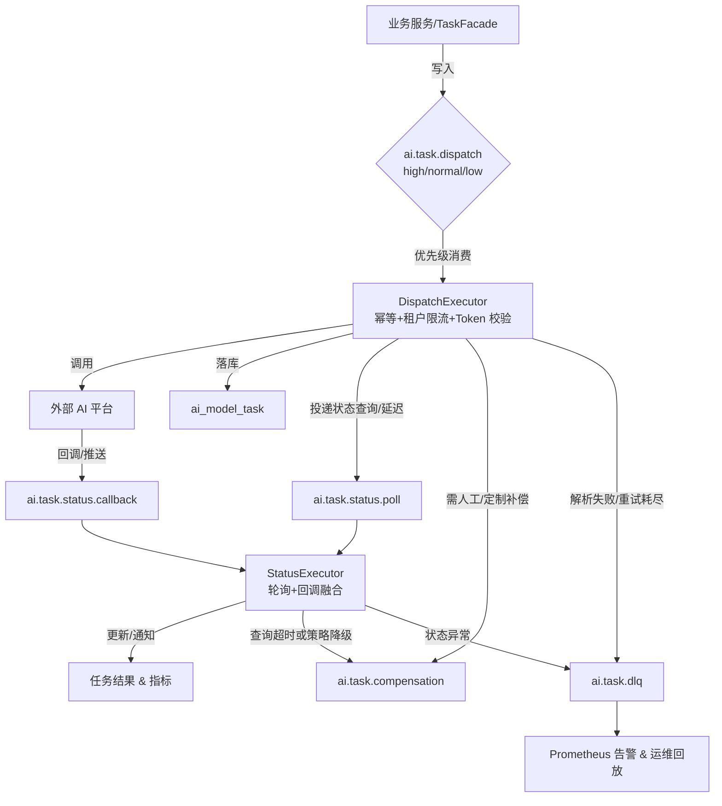

1. 设计目标
- 以 SpEL 模板统一描述各类大模型的请求与响应参数，降低模型供应商、版本切换和扩容成本。
- 模块聚焦“参数转换、流量承接、请求发起、结果回传”四项职责，不自制策略，只按上游传入的限流/配额策略执行。
- 通过“任务执行 / 任务状态”双执行器配合 RocketMQ 队列，实现异步化、弹性化、可观测的任务调度，满足租户级并发、RPM/QPS、Token 配额等管控需求。
2. 总体架构
业务服务 -> TaskFacade -> SpEL Adapter -> 归一化请求
                               |--> DispatchExecutor（执行层）
                               |        '--> RMQ 调度 + 外部 AI 平台
                               '--> StatusExecutor（状态层）
                                        '--> RMQ 状态队列 / 任务表
- SpEL 适配器：将业务上下文（Prompt、变量、租户配置）映射为各模型供应商需要的字段。
- DispatchExecutor：消费“任务请求”队列，聚合限流策略后发起外部调用。
- StatusExecutor：消费“任务状态”队列或接收外部回调，查询、解析结果并通知业务。
- RMQ 调度层：通过 Topic 划分、延迟队列、死信队列构建任务全链路调度与观测。

3. 任务流程
1. 业务调用 AimoudleController，TaskFacade 根据场景封装 AiTaskQuery 并写入 ai.task.dispatch.* Topic。
2. DispatchExecutor 消费消息 → 通过 SpEL 适配生成请求 → 调用外部 AI 平台 → 将任务 ID/traceId 写入 ai_model_task，并按策略投递状态查询消息。
3. StatusExecutor 消费 ai.task.status.* 或处理外部回调，查询结果并更新任务表。
4. 结果通过事件、回调或任务查询接口推送给业务，同时记录 Token 使用、限流指标。
5. 监控系统持续读取队列深度、任务表、死信队列，触发 SLA 告警与自愈动作。
4. SpEL 统一参数适配
1. 模板定义：在配置中心或数据库维护模型配置（`requestTemplate`、`headers`、`callback` 等），模板允许嵌入 SpEL 表达式，引用模型静态参数、租户策略、业务入参。模板带版本号与发布状态，执行器启动时缓存解析结果，配置变更通过监听或热刷新同步。
2. 运行时上下文：`AiModelContext` 承载业务入参、租户配额、渠道密钥、追踪信息等。执行器创建 `StandardEvaluationContext`，注册常用工具函数，以支持模板中的裁剪、拼接、签名等操作。
3. 适配策略：通过 `PreProcessor`/`PostProcessor` 扩展点实现校验、签名、加密、格式转换。模板解析后统一由 `ObjectMapper` 输出请求体，响应同样根据配置做字段解包，保障多模型复用。

5. 双执行器设计
5.1 DispatchExecutor（第一层执行器）
- 来源：`ai.task.dispatch.high/normal/low` 等 Topic。
- 逻辑：校验租户并发与 Token 预算 → 调用 SpEL 模板生成请求 → 使用 OkHttp/WebClient 发起调用 → 持久化任务并发送状态查询消息（可延迟）。
- 线程模型：独立线程池，核心线程数来自 `application.yml`（如 `executor.dispatch.core-threads`），默认值为 `min(availableProcessors, 3)`，在 CPU 充足时维持 3 个执行单元，资源不足时自动降级。
- 容错：按错误类型决定立即重试、延迟重试或写入死信，所有重试写入 `retryCount` 和失败原因。

5.2 StatusExecutor（第二层执行器）
- 来源：`ai.task.status.poll`、`ai.task.status.callback` 以及外部 webhook。
- 逻辑：根据任务记录选择轮询 API、等待回调或解析分段结果 → 按优先级控制查询节奏 → 更新 `ai_model_task` 并向业务发布 `ResultData`/事件。
- 线程模型：独立线程池，核心线程来自 `application.yml`（`executor.status.core-threads`），默认同样为 `min(availableProcessors, 3)`，保障至少三条状态查询通道且可按配置调整。
- 补偿：连续查询失败后自动降级为人工处理，任务投递至补偿队列以避免无效轮询。

6. RMQ 队列与调度策略
- 队列拓扑  
- ai.task.dispatch.high/normal/low：按优先级拆分 Topic，独立 consumerGroup 以便调整线程池与配额。  
- ai.task.status.poll：供 StatusExecutor 主动查询。  
- ai.task.status.callback：承接外部回调，统一解析后再分发。  
- ai.task.compensation：存放需要人工或定制补偿的任务。  
- ai.task.dlq：统一死信 Topic，集中监控和回放。
- 消费与限流  
- 消费端启用幂等校验（taskId + attempt），持久化成功后才 ACK。  
- consumeMessageBatchMaxSize、线程池核心数、租户级 RateLimiter 联动控制实际并发；Token 预算不足时拒绝消费并投递到延迟队列。  
- RPM/QPS 限制由本地或 Redis RateLimiter 实现，配置来源于 ai_queue_config 或策略中心。
- 补偿机制  
- 可重试错误：立即或延迟重新投递，并携带下一次可执行时间。  
- 外部平台限流（429 等）：根据响应头计算等待窗口，投递到 10s、30s、1min 等精确延迟队列。  
- 状态查询超时：回写 ai.task.compensation 供人工或脚本批处理。
- 死信策略  
- 触发条件：达到最大重试、消息解析失败、幂等冲突、关键字段缺失等。  
- 处理方式：死信消息包含失败原因、上下文快照、原 Topic，便于运维回放；Prometheus 监控 dlq_depth、retry_exhausted_count 触发告警。  
- 防堆积：为死信 Topic 设置保留时间、自动导出任务，支持批量回放或归档。

### 6.1 队列-执行器协作流程图

- DispatchExecutor 从三路调度 Topic 拉取任务，首先以 `taskId+attempt` 做幂等校验，同时读取 `ai_queue_config` 与租户 Token 预算，以 `consumeMessageBatchMaxSize`、线程池、RateLimiter 形成联动限流；不足配额则拒绝消费并转延迟队列。
- StatusExecutor 融合 `ai.task.status.poll` 与 `ai.task.status.callback` 流量，依据优先级动态分配线程并维护结果回写；超过 SLA 或多次失败自动降级至补偿队列。
- 补偿与死信：可重试错误进入延迟或补偿队列，由人工/脚本批处理；幂等冲突、关键字段缺失等不可恢复错误写入统一 DLQ，携带上下文供 Prometheus 监控与批量回放。

### 6.2 队列执行流与调度器接入点标注

| 队列/Topic | 所属执行流 | 调度器接入时机 | 说明 |
| --- | --- | --- | --- |
| `ai.task.dispatch.high/normal/low` | DispatchExecutor 主执行流 | TaskFacade 投递后，RMQ 调度器按优先级将消息分配至对应 consumerGroup，DispatchExecutor 在幂等校验后抢占额度执行。 | 三条主通道分别映射高/中/低优先级线程池，支持动态扩容与配额调整。 |
| `ai.task.status.poll` | StatusExecutor 轮询流 | DispatchExecutor 完成外部调用后写入状态查询任务，调度器根据 `consumeMessageBatchMaxSize` 与租户级 RateLimiter 控制拉取频率。 | 主要用于主动轮询型模型，允许根据 SLA 配置延迟等级。 |
| `ai.task.status.callback` | StatusExecutor 回调流 | 外部 AI 平台推送回调，经网关/解析器写入该 Topic；调度器将其快速分派给 StatusExecutor，绕过主动轮询。 | 与轮询通道共享状态线程池，通过优先级标签确保实时处理。 |
| `ai.task.compensation` | 补偿执行流 | DispatchExecutor/StatusExecutor 检测到需要人工或脚本介入时投递；调度器在离峰期触发补偿执行器或人工工具消费。 | 记录失败上下文与下一次可执行窗口，避免在主流中持续占用额度。 |
| 延迟队列（10s/30s/1min 等） | DispatchExecutor 补偿/重试流 | 外部限流或可重试错误发生时，调度器根据延迟级别挂起消息，时间到达后重新路由回 dispatch/status Topic。 | 通过精确延迟等级配合 Token 预算刷新，保障重试按策略执行。 |
| `ai.task.dlq` | 死信/观测流 | 任一执行器达到最大重试、解析异常或幂等冲突时写入；调度器仅供监控与回放程序读取，常态不回流主链路。 | 携带原 Topic 与失败原因，供 Prometheus 统计 `dlq_depth`、触发运维回放任务。 |
7. 存储与监控
- 表结构  
- dim_ai_model：模型维表，记录模型编号、供应商、适配能力、上下线状态，并维护统一的能力编码：  
  - 1：聊天（Chat）——常规问答、信息检索。  
  - 12：聊天-推理（Chat-Reasoning）——具备链式思考、逻辑推演。  
  - 2：图片（Image）——图像理解、描述、标注。  
  - 21：文本生成图片（Text2Image）——文本输入的多模态生成。  
  - 新能力需在此表登记编码、名称、描述，供模板和限流策略引用。  
- dim_ai_model_config：模型配置表，存放 SpEL 模板、Header 模板、回调参数、签名策略等，支持版本和生效时间。  
- ai_model_task：任务主表，记录任务元数据、外部任务 ID、Token 预算快照、重试统计。  
- ai_model_task_log：任务日志表，记录每次执行、补偿、死信等明细。  
- ai_queue_config：RMQ 队列/限流配置表，维护 Topic + 租户/模型的并发阈值、RPM/QPS、最大重试次数、延迟等级等参数，执行器在启动或定时刷新时加载。
- 监控指标实现  
- DispatchExecutor、StatusExecutor 入口/出口埋点 Micrometer Counter、Timer，输出 dispatch_qps、status_latency。  
- TokenBudget、RateLimiter 组件通过 Gauge 记录 token_usage、剩余额度，扣减失败时递增 Counter。  
- 重试与死信逻辑对 retry_times、dlq_depth 写入 Counter/Gauge，队列深度可结合 RMQ 统计或定时扫描。  
- 补偿队列消费者周期性记录 compensation_backlog。  
- 所有指标通过 Prometheus Exporter 暴露(/actuator/prometheus)，由 Prometheus 抓取、Grafana 展示并配置告警。
